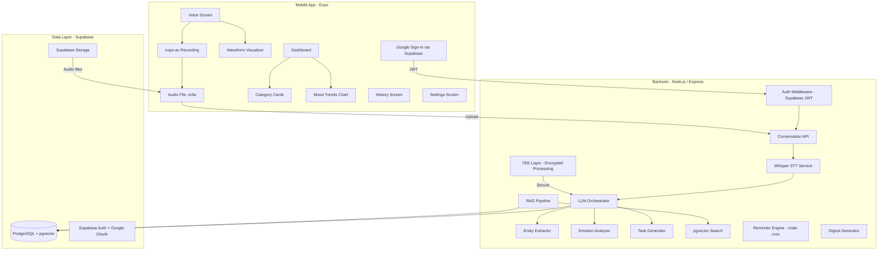

# LifeSort – AI-Powered Conversational Life Companion (MVP)

An empathetic, voice-first AI companion that transforms natural spoken conversations into structured personal organization: tasks, emotional tracking, reminders, and proactive support.

## User Review Required

> [!IMPORTANT]
> **API Keys Needed**: OpenAI (Whisper + embeddings), chosen LLM (GPT-4o-mini default), Google OAuth Client ID. Which LLM provider do you want as primary?

> [!IMPORTANT]
> **Auth Platform**: Plan uses **Supabase** for Auth (with Google OAuth provider) + PostgreSQL + pgvector + Storage — all-in-one. Confirm this works for you.

> [!WARNING]
> **Expo Go Limitations**: Audio recording with metering requires a dev build (`npx expo run:android`), not Expo Go. You'll need Android Studio or Xcode.

## Open Questions

1. **LLM Provider**: Grok vs GPT-4o-mini vs Claude 3.5 Sonnet? (Defaults to GPT-4o-mini)
2. **"TEEE"**: Interpreted as **TEE (Trusted Execution Environment)** for secure AI processing of sensitive user data. Is this correct, or did you mean something else?
3. **Offline scope**: Full on-device Whisper (`whisper.rn`) or cloud Whisper + offline caching?
4. **Target platforms**: iOS + Android, or Android-only for MVP?
5. **Existing animation templates**: Do you have any, or build from scratch with Reanimated?

---

## Architecture Overview



---

## Key Changes from Previous Plan

| Area | Before | Now |
|------|--------|-----|
| **Backend** | Python FastAPI, SQLAlchemy, Alembic | **Node.js Express**, Prisma ORM, Prisma Migrate |
| **Auth** | Supabase email/password only | **Google OAuth** via Supabase Auth + email/password fallback |
| **Security** | Basic RLS + HTTPS | **TEE layer** for encrypted AI processing of sensitive conversations |
| **Testing** | pytest | **Jest + Supertest** |

---

## Project Structure

```
LifeSort/
├── app/                          # Expo Router (routes only)
│   ├── (auth)/
│   │   ├── _layout.tsx
│   │   ├── login.tsx             # Google Sign-In + email option
│   │   └── signup.tsx
│   ├── (tabs)/
│   │   ├── _layout.tsx
│   │   ├── index.tsx             # Dashboard
│   │   ├── conversation.tsx      # Voice screen
│   │   ├── history.tsx
│   │   ├── mood.tsx
│   │   └── settings.tsx
│   ├── _layout.tsx               # Root layout + providers
│   └── index.tsx                 # Entry redirect
├── src/
│   ├── components/
│   │   ├── ui/                   # Button, Card, Input, etc.
│   │   ├── voice/                # WaveformVisualizer, VoiceButton
│   │   ├── dashboard/            # CategoryCard, QuickActions
│   │   ├── mood/                 # MoodChart, MoodBadge
│   │   └── common/               # Header, LoadingState, EmptyState
│   ├── hooks/
│   │   ├── useAudioRecorder.ts
│   │   ├── useConversation.ts
│   │   ├── useAuth.ts            # Google + email auth
│   │   └── useMoodData.ts
│   ├── lib/
│   │   ├── supabase.ts           # Supabase client + Google OAuth config
│   │   ├── api.ts
│   │   └── storage.ts
│   ├── store/                    # Zustand stores
│   │   ├── authStore.ts
│   │   ├── conversationStore.ts
│   │   └── settingsStore.ts
│   ├── constants/
│   │   ├── colors.ts
│   │   ├── typography.ts
│   │   ├── spacing.ts
│   │   └── animations.ts
│   └── types/
│       └── index.ts
├── backend/
│   ├── src/
│   │   ├── server.js
│   │   ├── config/
│   │   │   ├── index.js          # ENV config
│   │   │   └── supabase.js       # Supabase admin client
│   │   ├── middlewares/
│   │   │   ├── authMiddleware.js  # Supabase JWT verification
│   │   │   ├── errorHandler.js
│   │   │   ├── rateLimiter.js
│   │   │   └── teeMiddleware.js   # TEE encryption layer
│   │   ├── routes/
│   │   │   ├── authRoutes.js
│   │   │   ├── conversationRoutes.js
│   │   │   ├── taskRoutes.js
│   │   │   ├── moodRoutes.js
│   │   │   └── reminderRoutes.js
│   │   ├── controllers/
│   │   │   ├── authController.js
│   │   │   ├── conversationController.js
│   │   │   ├── taskController.js
│   │   │   ├── moodController.js
│   │   │   └── reminderController.js
│   │   ├── services/
│   │   │   ├── whisperService.js   # OpenAI Whisper STT
│   │   │   ├── llmOrchestrator.js  # Multi-provider LLM
│   │   │   ├── ragService.js       # pgvector semantic search
│   │   │   ├── emotionService.js
│   │   │   ├── digestService.js
│   │   │   └── teeService.js       # TEE encryption/decryption
│   │   └── prompts/
│   │       ├── entityExtraction.js
│   │       ├── emotionAnalysis.js
│   │       ├── responseGeneration.js
│   │       └── weeklyReview.js
│   ├── prisma/
│   │   └── schema.prisma          # DB schema + migrations
│   ├── package.json
│   ├── Dockerfile
│   └── docker-compose.yml         # PostgreSQL + pgvector local
├── assets/
├── global.css
├── app.json
├── metro.config.js
├── postcss.config.mjs
└── package.json
```

---

## Proposed Changes

### Phase 0: Project Setup

#### [NEW] Expo Project Init
- `npx create-expo-app@latest ./` with TypeScript
- Install: `nativewind`, `react-native-reanimated`, `expo-av`, `expo-file-system`, `@supabase/supabase-js`, `zustand`, `react-native-svg`, `expo-haptics`, `expo-secure-store`, `expo-auth-session`, `expo-web-browser`
- Configure NativeWind v5, Expo Router, env vars

#### [NEW] Node.js Backend Init
- Express project in `backend/` with ES modules
- Install: `express`, `prisma`, `@prisma/client`, `openai`, `multer`, `cors`, `helmet`, `express-rate-limit`, `node-cron`, `@supabase/supabase-js`, `jsonwebtoken`, `zod`
- Docker Compose for local PostgreSQL 16 + pgvector extension

---

### Phase 1: Design System & Core UI

#### [NEW] Design Tokens

```typescript
export const colors = {
  light: {
    primary: '#10B981',       // Sage green
    primaryLight: '#D1FAE5',
    primaryDark: '#059669',
    accent: '#14B8A6',        // Teal
    background: '#F8FAFC',
    surface: '#FFFFFF',
    surfaceElevated: '#F1F5F9',
    text: '#1F2937',
    textSecondary: '#64748B',
    border: '#E2E8F0',
    success: '#10B981', warning: '#F59E0B', error: '#EF4444',
    mood: { great: '#10B981', good: '#34D399', neutral: '#FBBF24', low: '#F97316', tough: '#EF4444' },
  },
  dark: {
    primary: '#34D399',
    background: '#0F172A',    // Deep navy
    surface: '#1E293B',
    surfaceElevated: '#334155',
    text: '#F1F5F9',
    textSecondary: '#94A3B8',
    border: '#334155',
  },
};
```

#### [NEW] Animated Components
| Component | Description |
|-----------|-------------|
| `AnimatedCard` | Spring lift-on-press, glassmorphism |
| `PulseButton` | Breathing animation for record button |
| `WaveformVisualizer` | Real-time SVG bars via Reanimated SharedValues |
| `FadeInView` | Entering animation wrapper |
| `ShimmerLoader` | Skeleton loading |
| `MoodOrb` | Gradient circle shifting by emotion |

#### [NEW] Screens
| Screen | Key Elements |
|--------|-------------|
| **Login** | Google Sign-In button (branded), email fallback, animated logo |
| **Voice** | Pulsing record button, waveform, transcription preview |
| **Dashboard** | Greeting, category cards, quick-action FAB, recent tasks |
| **History** | Searchable list, date groups, emotion badges |
| **Mood** | Line chart, period selector, mood distribution donut |
| **Settings** | Theme toggle, notifications, data export, linked Google account |

---

### Phase 2: Backend Foundation (Node.js/Express)

#### [NEW] Auth — Google OAuth + Supabase

**Frontend flow:**
1. User taps "Sign in with Google" → `expo-auth-session` opens Google consent
2. Google returns ID token → passed to Supabase `signInWithIdToken()`
3. Supabase creates/links user, returns JWT
4. JWT stored in `expo-secure-store`, sent as `Authorization: Bearer` header

**Backend flow:**
```javascript
// authMiddleware.js
const { createClient } = require('@supabase/supabase-js');
const supabase = createClient(SUPABASE_URL, SUPABASE_SERVICE_KEY);

const authMiddleware = async (req, res, next) => {
  const token = req.headers.authorization?.replace('Bearer ', '');
  const { data: { user }, error } = await supabase.auth.getUser(token);
  if (error) return res.status(401).json({ error: 'Unauthorized' });
  req.user = user;
  next();
};
```

#### [NEW] TEE (Trusted Execution Environment) Layer

> [!NOTE]
> TEE ensures sensitive user data (transcripts, emotions, personal details) is processed in encrypted memory that even the server operator cannot access.

**Implementation approach:**
- **Encryption at rest**: All conversation transcripts and emotion data encrypted with per-user keys (AES-256-GCM) before DB storage
- **Encryption in transit**: TLS 1.3 for all API communication
- **TEE middleware**: Wraps AI processing endpoints — decrypts user data in secure memory, processes through LLM, encrypts results before storage
- **Key management**: Per-user encryption keys derived from Supabase auth, stored in secure vault
- **Data isolation**: Each user's data processed in isolated context, memory cleared after processing

```javascript
// teeService.js — Secure processing wrapper
const crypto = require('crypto');

class TEEService {
  deriveUserKey(userId, masterSecret) { /* HKDF derivation */ }
  encrypt(plaintext, userKey) { /* AES-256-GCM */ }
  decrypt(ciphertext, userKey) { /* AES-256-GCM */ }
  
  async secureProcess(userId, rawTranscript, processFn) {
    const key = this.deriveUserKey(userId, process.env.MASTER_SECRET);
    const decrypted = this.decrypt(rawTranscript, key);
    const result = await processFn(decrypted);  // LLM processing
    return this.encrypt(JSON.stringify(result), key);
  }
}
```

#### [NEW] Prisma Schema
```prisma
datasource db {
  provider = "postgresql"
  url      = env("DATABASE_URL")
  extensions = [pgvector]
}

model User {
  id            String   @id @default(uuid())
  email         String   @unique
  displayName   String?
  avatarUrl     String?  // From Google profile
  googleId      String?  @unique
  preferences   Json     @default("{}")
  encryptionSalt String  // For TEE key derivation
  conversations Conversation[]
  tasks         Task[]
  moodEntries   MoodEntry[]
  createdAt     DateTime @default(now())
}

model Conversation {
  id              String   @id @default(uuid())
  userId          String
  user            User     @relation(fields: [userId], references: [id])
  title           String?
  encryptedTranscript  Bytes   // TEE-encrypted
  summary         String?
  flowType        String   // brain_dump, quick_vent, morning_checkin
  durationSeconds Int?
  overallSentiment Float?
  categories      String[]
  embedding       Unsupported("vector(1536)")?
  metadata        Json     @default("{}")
  tasks           Task[]
  moodEntries     MoodEntry[]
  createdAt       DateTime @default(now())
}

model Task {
  id              String   @id @default(uuid())
  userId          String
  user            User     @relation(fields: [userId], references: [id])
  conversationId  String?
  conversation    Conversation? @relation(fields: [conversationId], references: [id])
  title           String
  description     String?
  category        String?
  priority        String   @default("medium")
  status          String   @default("pending")
  dueDate         DateTime?
  people          String[]
  reminders       Reminder[]
  createdAt       DateTime @default(now())
}

model MoodEntry {
  id              String   @id @default(uuid())
  userId          String
  user            User     @relation(fields: [userId], references: [id])
  conversationId  String?
  conversation    Conversation? @relation(fields: [conversationId], references: [id])
  score           Float
  emotions        String[]
  triggers        String[]
  notes           String?
  createdAt       DateTime @default(now())
}

model Reminder {
  id            String   @id @default(uuid())
  taskId        String
  task          Task     @relation(fields: [taskId], references: [id])
  message       String
  scheduledAt   DateTime
  isSent        Boolean  @default(false)
  reminderType  String   @default("task")
}
```

#### [NEW] API Routes

| Method | Endpoint | Auth | Purpose |
|--------|----------|------|---------|
| POST | `/api/auth/google` | No | Exchange Google token for Supabase session |
| POST | `/api/conversations` | Yes | Upload audio → transcribe → parse → respond |
| GET | `/api/conversations` | Yes | List with filters |
| GET | `/api/conversations/:id` | Yes | Full detail with entities |
| GET | `/api/tasks` | Yes | Tasks with status filters |
| PATCH | `/api/tasks/:id` | Yes | Update task status |
| GET | `/api/moods` | Yes | Mood history |
| GET | `/api/moods/trends` | Yes | Aggregated trends |
| GET | `/api/dashboard` | Yes | Combined dashboard data |
| GET | `/api/digests/daily` | Yes | AI daily digest |
| GET | `/api/digests/weekly` | Yes | AI weekly "Life Review" |
| POST | `/api/reminders` | Yes | Create reminders |

---

### Phase 3: AI Core

#### [NEW] LLM Orchestrator (Node.js)

Processing pipeline when audio is received:
1. **Whisper STT** → Clean transcript (remove fillers)
2. **TEE Decrypt** → Securely access past conversation context
3. **Topic Segmentation** → Split into topic blocks
4. **Entity Extraction** → Structured JSON (tasks, people, events, deadlines)
5. **Emotion Analysis** → Sentiment score, emotions, triggers
6. **RAG Context** → pgvector similarity search on past conversations
7. **Response Generation** → Empathetic reply with CoT
8. **TEE Encrypt** → Encrypt results before storage
9. **Embedding** → Store for future RAG

#### [NEW] Prompt Library (`.js` files with template literals + Zod validation)
- `entityExtraction.js` — Tasks, people, events, deadlines
- `emotionAnalysis.js` — Sentiment + emotion classification
- `responseGeneration.js` — Empathetic responses with CoT
- `weeklyReview.js` — "Life Review" summaries

---

### Phase 4: Voice & Integration

#### [NEW] Audio Recording Flow
1. Tap record → `expo-av` records (44.1kHz, mono, .m4a)
2. Metering → dB polled 100ms → Reanimated SharedValues → waveform bars
3. 2s silence → auto-pause prompt
4. Stop → `FileSystem.uploadAsync` to backend
5. Backend returns: transcript, AI response, entities, mood
6. UI animates results with staggered FadeIn

#### [NEW] Waveform Visualizer
- `react-native-svg` + `react-native-reanimated`
- 40 bars on UI thread, spring interpolation
- Gradient coloring, breathing animation when idle

---

### Phase 5: Polish & Deployment

#### Animations
- Spring card lifts, voice button pulse/glow, staggered dashboard cards
- Mood chart animated path drawing, haptic feedback

#### Privacy & Security (TEE + RLS)
- Supabase RLS: users access only own data
- TEE encryption for all transcript/emotion data at rest
- Audio deleted post-transcription (configurable)
- API keys in `expo-secure-store`
- HTTPS only, TLS 1.3

#### Accessibility
- VoiceOver/TalkBack labels, 44px touch targets, reduced motion support

#### Offline
- Zustand persist + AsyncStorage, retry queue for failed API calls

---

## Implementation Order

| Phase | Scope | Est. Files |
|-------|-------|-----------|
| **0** | Expo init, Node.js backend init, Docker, folder structure | ~15 |
| **1** | Design tokens, UI components, all screens (static) | ~30 |
| **2** | Prisma schema, migrations, API routes, Google Auth, TEE layer | ~25 |
| **3** | Whisper, LLM orchestrator, prompts, RAG pipeline | ~12 |
| **4** | Audio recording, waveform viz, conversation flow | ~8 |
| **5** | Animations, accessibility, offline, privacy, deploy | ~10 |

---

## Verification Plan

### Automated Tests
- Backend: **Jest + Supertest** for all routes, mocked LLM calls, TEE encrypt/decrypt
- Frontend: React Native Testing Library for component renders
- E2E: Manual testing on dev build

### Manual Verification
- Record 2-min brain dump → verify transcript + tasks + mood
- Google Sign-In flow on device
- TEE: verify encrypted data in DB is unreadable without user key
- Dashboard populates correctly
- Dark mode across all screens
- Offline → online sync
- All 3 user flows (Brain Dump, Quick Vent, Morning Check-in)
- Performance: <2s transcription start, <4s AI response
